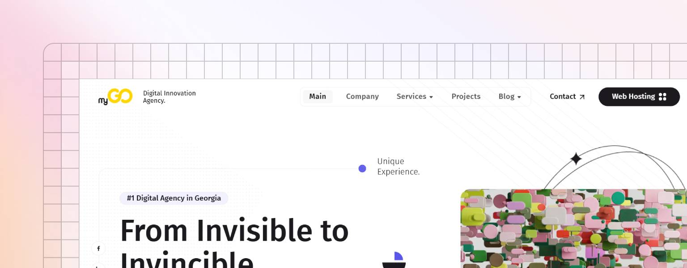

# myGO - Digital Innovation Agency

<figure><figcaption></figcaption></figure>

[**myGO**](https://mygo.ge/?from=gitbook) is a reliable and stable technology partner that has been building a strong digital foundation for leading companies in the Georgian market for over 13 years. Our story began in 2012, and ever since, we have been united by one core mission - empowering and growing Georgian online businesses through modern technologies.

With over [500 successful projects](https://mygo.ge/en/works?from=gitbook) during these 13 years of experience, we’ve proven that every service we provide is not just a technical solution - but a precisely tailored, results-driven system that creates real value.

We believe that true value is created only when technology serves business correctly, quickly, and effectively. That’s why today, [**myGO**](https://mygo.ge/?from=gitbook) represents a digital push that eliminates wasted time and delivers solutions focused on measurable outcomes.

**Our approach is based on:**

* In-depth industry analysis
* High-standard design and development
* Deep understanding of B2B segment needs
* Optimal balance of innovation and efficiency

**Our Mission**

Our mission is to establish [**myGO**](https://mygo.ge/?from=gitbook) as the most reliable, result-oriented, and long-term digital partner for businesses. We operate with unwavering energy and consistency to set a new standard of digital comfort and quality in the Georgian internet space.

We believe that digital communication should not be complex or confusing — it must be simple, effective, and value-focused. That’s why our goal is to eliminate existing technical and strategic barriers through professional and innovative approaches.

**Our Vision**

We strive to position [**myGO**](https://mygo.ge/?from=gitbook) as a company that continuously develops and delivers innovative digital products and tools that empower business growth, operational efficiency, and long-term success.

Our vision is to become the leader of digital transformation in Georgia — a platform of technological solutions that not only responds to market challenges, but anticipates them and builds the future today.


Details - [https://mygo.ge/en/static/company](https://mygo.ge/en/static/company)

